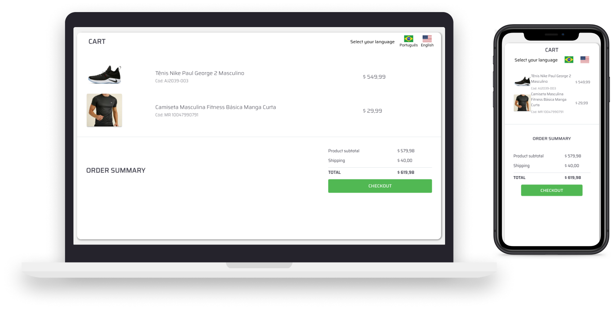

# Página de Checkout de pagamento Multi-linguagem




## 👨🏻‍💻 sobre o projeto

- <p style="color: red;">Este projeto foi criado para fins de teste do Framework de internacionalização [I18N](https://www.i18next.com/), que é focado em gerenciar traduções  em diversas linguagens, na aplicação em questão foram realizados traduções somente de Inglês para português</p>
Link da aplicação: https://www.dyotechstore.ml


## 🚀 Tecnologias

Technologies that I used to develop this web client

- [ReactJS](https://reactjs.org/)
- [TypeScript](https://www.typescriptlang.org/)
- [React Router DOM](https://reacttraining.com/react-router/)
- [i18n](https://www.i18next.com/)


## 💻 Iniciando o projeto

**Clone o projeto e acesse a pasta**

```bash
$ git clone https://github.com/msalves008/React_LetMeAsk.git && cd React_LetMeAsk
```

**Siga os passos a baixo**

```bash
# Instalando as dependências
$ yarn install


# Iniciando o projeto
$ yarn start
```


---

Made with 💜 &nbsp;by Matheus Alves 👋 &nbsp;[See my linkedin](https://www.linkedin.com/in/msalves008)


## 👨‍💻 Criador


<table>
  <tr>
    <td align="center">
      <a href="#">
        <br>
        <sub>
          <b>Matheus Alves</b>
        </sub>
      </a>
    </td>   
   
  </tr>
</table>

